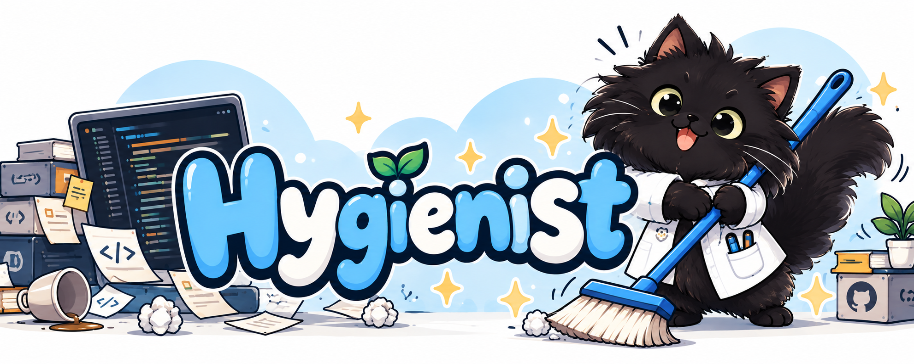

# Hygienist

Hygienist helps your AI coding agent keep an eye on the small repository details
that are easy to miss. Add project-specific checks once, then ask it to run them
when you want a quick health check—before a pull request, after a config change,
or whenever something feels easy to overlook.

## Safety

> [!WARNING]
> Rules are instructions followed by an agent with access to your project and
> its available tools. A malicious rule can request secret disclosure, network
> uploads, file deletion, or other destructive actions. Review third-party
> rules and any scripts they call before running them. Hygienist does not
> automatically inspect or filter rules, and does not provide its own security
> sandbox. The optional `inspect` operation can help you assess risk, but its
> report is advisory and cannot guarantee that a rule is safe.

## Install

With Node.js installed, you can install Hygienist using the
[skills CLI](https://github.com/vercel-labs/skills):

```sh
npx skills add cleg/hygienist --skill hygienist --global
```

Follow the installer prompts to choose your coding agents. The `--global` flag
makes the skill available across your projects. To select Codex and Goose
explicitly:

```sh
npx skills add cleg/hygienist --skill hygienist --global --agent codex goose
```

### Use a local checkout

If you're working on Hygienist itself, link this source repository into your
agent's skills directory so edits are available immediately. Replace
`/absolute/path/to/hygienist` with this repository's path.

```sh
# Codex
mkdir -p ~/.codex/skills
ln -s /absolute/path/to/hygienist ~/.codex/skills/hygienist

# Goose
mkdir -p ~/.agents/skills
ln -s /absolute/path/to/hygienist ~/.agents/skills/hygienist
```

If you already have a Hygienist installation, take a look before creating the
link so you don't replace it by accident. If the skill doesn't show up right
away, start a new agent session. In Goose, `goose skills list` can confirm
whether it's available.

## Use

Start your agent in the project you'd like it to help with, then ask in your
own words. For example:

| Goal | Example request |
| --- | --- |
| Set up Hygienist in a project | `Use $hygienist to init this project` |
| Add a project-specific check | `Use $hygienist to add-rule: verify that all environment variables are documented` |
| Review checks for risky instructions | `Use $hygienist to inspect this project` |
| Run the project's checks | `Use $hygienist to check repository hygiene` |

In Codex, invoke the skill with `$hygienist`. In Goose, use `/skills hygienist`
(the original MVP also supported `/skill hygienist`). With another agent, use
its usual skill invocation—or ask it to read Hygienist's installed instructions.

### Initialize

Initialization creates `.hygienist/` if it does not exist, then offers optional
starter checks. Choose any combination or none. If the directory already
exists, initialization leaves its contents alone; ask to add a rule instead.
Initializing a project does not run checks.

### Add checks

Checks are Markdown files named `NN-name.md` in `.hygienist/`, where `NN` is a
number with at least two digits. Ask the agent to add a check in plain language;
it will clarify important details such as scope, pass/fail criteria, and
whether it may make repairs. Adding a check does not run it.

### Review checks

`inspect` reads the project's rules and reports potentially risky behavior,
with paths, line numbers, and safer alternatives. It does not execute rules or
change files. The report is advisory: it cannot guarantee that a rule is safe,
and it does not automatically block a later run.

### Run checks

Ask the agent to run the checks when you want a repository hygiene review, such
as after a set of changes or before a commit. Each check runs independently and
returns `OK` or `FAIL`; the report includes the check path and its message. A
failed check does not prevent the remaining checks from running. If there are
no matching checks yet, Hygienist reports an empty result. You can start with a
template or add a rule that fits the project.

## A few possible workflows

Here are a few hypothetical ideas you could adapt into your own rules. Choose
checks that fit the way your project works.

- **Before opening a pull request:** ask Hygienist to look for unresolved
  conflict markers, accidentally committed OS files, or missing changelog
  entries.
- **After changing configuration:** add a rule to check that documented
  environment variables still match the settings the application reads.
- **When preparing a release:** ask for a check that verifies version numbers
  agree across the package metadata, CLI output, and release notes.
- **For a data or API project:** add a read-only check for required schema
  fields, migration naming, or compatibility notes.

These can be as lightweight as a reminder to inspect a file or as specific as a
clear pass/fail check. If you want a rule to make repairs, say which files it
may change when you ask the agent to create it.

## Starter checks

During initialization, you can choose from these optional templates:

| Check | What it does |
| --- | --- |
| [Environment example](templates/10-env-example.md) | Aligns `.env.example` keys with `.env` and clears example values. It never changes `.env`; if `.env` is absent, it skips synchronization and audits an existing example for secrets. |
| [OS artifacts](templates/20-os-artifacts.md) | Adds common macOS, Windows, and Linux artifact patterns to `.gitignore`; suggests untracking indexed artifacts without removing them automatically. |
| [Conflict markers](templates/30-conflict-markers.md) | Reports unresolved merge markers and unmerged Git index entries without editing files. |

The first two templates can make limited repairs to project files. Have a look
at a template before choosing it, and review installed rules before asking your
agent to run them.
